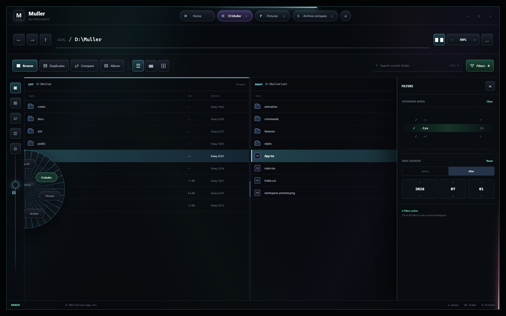

<div align="center">
  
  <h1>Muller</h1>
  <p><strong>面向 Windows 11 的文件智能工作台</strong></p>
  <p>浏览、检索、查重、差异比对与安全文件操作，统一在一个安静而高效的桌面界面中。</p>
  <p>
    <a href="https://github.com/AuAtmos/Muller/releases/tag/v0.1.3"><strong>下载 0.1.3</strong></a>
    ·
    <a href="CHANGELOG.md">更新记录</a>
    ·
    <a href="docs/README.md">项目文档</a>
  </p>
  <p>
    <a href="https://github.com/AuAtmos/Muller/actions/workflows/ci.yml"></a>
    <a href="https://github.com/AuAtmos/Muller/releases"></a>
    
    <a href="LICENSE"></a>
  </p>
</div>



## 为什么是 Muller

自然界中的光不只有明暗和颜色，还携带一种肉眼难以直接看见的状态：**偏振**。
光穿过大气、晶体或生物组织时，介质会改变它的偏振；在偏振光学中，一个
`4×4` 的**穆勒矩阵**以 16 个元素描述这种变换，让入射光的斯托克斯向量经过
系统后，成为可测量的出射状态。

```text
S_out = M S_in
```

Muller 的名字来自这一思想。用户带着一个探查目标进入系统，就像给出一束已知
状态的入射光；Muller 不是一块简单的“文件列表”，而是一组协同工作的变换：
浏览建立空间坐标，搜索收束目标，查重揭示隐藏关系，比较分解差异，预览补全
上下文。经过这套矩阵式工作流，零散而隐蔽的文件信息被组织成清晰、可操作的结果。

这个类比并不意味着软件就是数学意义上的穆勒矩阵，而是共享同一种方法：不被
表面现象止步，通过结构化的输入、变换与观测，辨认系统内部原本难以看见的关系。
Muller 为开发者、摄影工作流和重度文件管理用户保留熟悉的 Windows 文件操作，
同时把每一次探查折射为系统深处更清晰的真相。

> **执穆勒矩阵破译光之偏振的律法，将每一次探查，折射为系统深处最清晰的真相。**

| 工作区 | 能力 |
|---|---|
| **Browse** | 双栏目录、标签页、面包屑、全局与目录搜索、列表/网格/相册视图 |
| **Duplicates** | 分级哈希扫描、KEEP/DUP 审阅、可回收删除、取消与进度隔离 |
| **Compare** | 目录差异、Myers 文本差异、十六进制范围、双向合并与原子保存 |
| **Preview** | 图片、RAW、GIF、音视频、PPTX 封面、代码、配置与文本型 BLOB |
| **Workspace** | 深色、浅色、Monochrome Platinum、JSON 主题、可选毛玻璃与流光外框 |

## 技术架构

Muller 是“Web 技术构建界面 + Rust 原生后端 + Windows WebView2 宿主”的
桌面应用，不是 WebAssembly 应用，也不随程序打包 Chromium 或 Node.js。

```text
React / TypeScript / Motion / CodeMirror / Three.js
                         │
                    Tauri IPC
                         │
       Rust workspace + Tauri commands
                         │
       Windows Shell / COM / GDI / File System
```

| 层级 | 当前技术 |
|---|---|
| **界面** | React 19、TypeScript 5.9、Vite 7、Motion、Lucide React |
| **编辑与视觉** | CodeMirror 6、Three.js、WebGL |
| **桌面宿主** | Tauri 2、Microsoft Edge WebView2 |
| **原生后端** | Rust 1.89、Edition 2024、Serde、ZIP、图片与媒体元数据解析 |
| **Windows 集成** | `windows` / `windows-sys`，连接 Shell、COM、GDI、托盘、快捷键和文件系统 |
| **质量与交付** | Vitest、Playwright、Cargo Test、Clippy、rustfmt、NSIS |

Vite 在构建阶段将前端编译成普通 HTML、CSS 和 JavaScript，由 WebView2
负责渲染；搜索、查重、预览、差异计算和文件操作通过 Tauri IPC 调用原生
Rust 命令。最终的 Rust 后端编译为 Windows PE 机器码，而不是 `wasm32`
目标。`Cargo.lock` 中出现的 `wasm-bindgen`、`web-sys` 来自部分跨平台依赖的
条件性传递依赖，并不表示 Muller 正在使用 WebAssembly。

### 为真实文件准备

- 复制、剪切、粘贴、重命名、压缩、解压和属性查看均连接 Windows 原生文件系统。
- Home 搜索结果与普通目录条目共享完整右键菜单和路径操作。
- UNC 地址、Windows 已知文件夹、磁盘路径及双栏历史由独立会话管理。
- 代码与配置预览覆盖 INI、BAT、C/C++、Rust、TOML、TypeScript、JSON、YAML
  等开发者常用格式；无法确认是文本的 BLOB 会保持只读二进制状态。
- RAW 与 PPTX 优先使用内嵌缩略图，再回退到 Windows Shell 提供程序。

### 安全优先

- 删除默认进入回收站，不提供无提示的永久删除。
- 目录复制先写入同目标卷暂存区，校验内容后再提交。
- 合并保存会检查大小、修改时间和 BLAKE3，发现外部变化时拒绝覆盖。
- Windows 受保护目录、符号链接和重解析别名保持只读边界。
- 扫描、预览、缩略图和比较任务均可取消，并隔离过期异步结果。

## 下载与运行

前往 [Muller 0.1.3 Release](https://github.com/AuAtmos/Muller/releases/tag/v0.1.3)
下载 Windows x64 版本：

| 文件 | 用途 |
|---|---|
| `Muller_0.1.3_x64-setup.exe` | 推荐。安装到 Windows，并创建正常的应用入口 |
| `Muller_0.1.3_x64-portable.exe` | 免安装，适合移动磁盘或临时使用 |
| `SHA256SUMS.txt` | 两个可执行文件的 SHA-256 校验值 |

目标电脑不需要 Node.js、Rust、Visual Studio 或源码。Windows 11 通常已经包含
Microsoft Edge WebView2 Runtime；精简系统如缺少它，只需安装一次 Evergreen
WebView2 Runtime。全新安装会从当前 Windows 用户目录打开，并默认使用 Muller
Monochrome Platinum；已有用户保存的工作区和主题不会被覆盖。

> [!WARNING]
> 0.1.3 是未签名的公开预览版，Windows SmartScreen 可能显示“未知发布者”。
> 请只从本仓库 Releases 下载，并使用 `SHA256SUMS.txt` 核对文件。

## 快速上手

- `Ctrl+1` / `Ctrl+2` / `Ctrl+3`：切换 Browse、Duplicates、Compare。
- `Ctrl+F`：搜索当前目录或当前结果集。
- `Space`：打开或关闭选中文件预览。
- `Ctrl+K`：打开命令面板。
- `F2` / `Delete`：重命名 / 移入回收站。
- `Ctrl+Shift+Space`：从托盘恢复 Muller。

## 从源码构建

环境要求：

- Windows 11 x64
- Node.js 24+ 与 npm 11+
- Rust 1.89+，MSVC toolchain
- Microsoft C++ Build Tools 与 WebView2

```powershell
npm ci
npm run tauri dev
```

生成发布构建：

```powershell
npm run tauri -- build --bundles nsis
```

质量检查：

```powershell
npm run lint
npm test
npm run build
cargo fmt --all -- --check
cargo test --workspace --locked
cargo clippy --workspace --all-targets --all-features --locked -- -D warnings
npm run test:e2e
```

## 工程结构

| 路径 | 职责 |
|---|---|
| `src/` | React 界面、工作区状态、主题、交互与前端测试 |
| `src-tauri/` | Tauri 桌面边界、Windows Shell 集成与原生命令 |
| `crates/muller-core/` | 重复文件扫描、身份与哈希漏斗 |
| `crates/muller-diff/` | 文件夹、文本和二进制差异引擎 |
| `crates/muller-mutate/` | 原子写入、安全复制、回收站与路径策略 |
| `e2e/` | Windows Edge 端到端验收 |
| `themes/` | 可导入主题示例 |
| `docs/` | 产品设计、阶段报告、发布检查与路线图 |

详细设计与实现证据见 [文档索引](docs/README.md)。当前 0.1.3 已通过
76 个前端单元测试、122 个 Rust 测试和 83 个 Edge 端到端场景；真实微软拼音/
微信输入法、Windows 登录与升级、物理多屏、高 DPI、144Hz、慢盘、OneDrive
与复杂 UNC 环境仍属于候选安装版人工验证范围。

## 路线图

当前版本覆盖非特权桌面工作流。下一阶段计划将 MFT/USN 全盘索引拆成
独立、只读、可选安装的 Windows 服务；没有该服务时仍保留普通遍历搜索。
完整阶段状态见[起始开发归档](docs/archive/initial-development/implementation-roadmap.md)。

## License

Muller 使用 [GNU General Public License v3.0](LICENSE) 发布。
